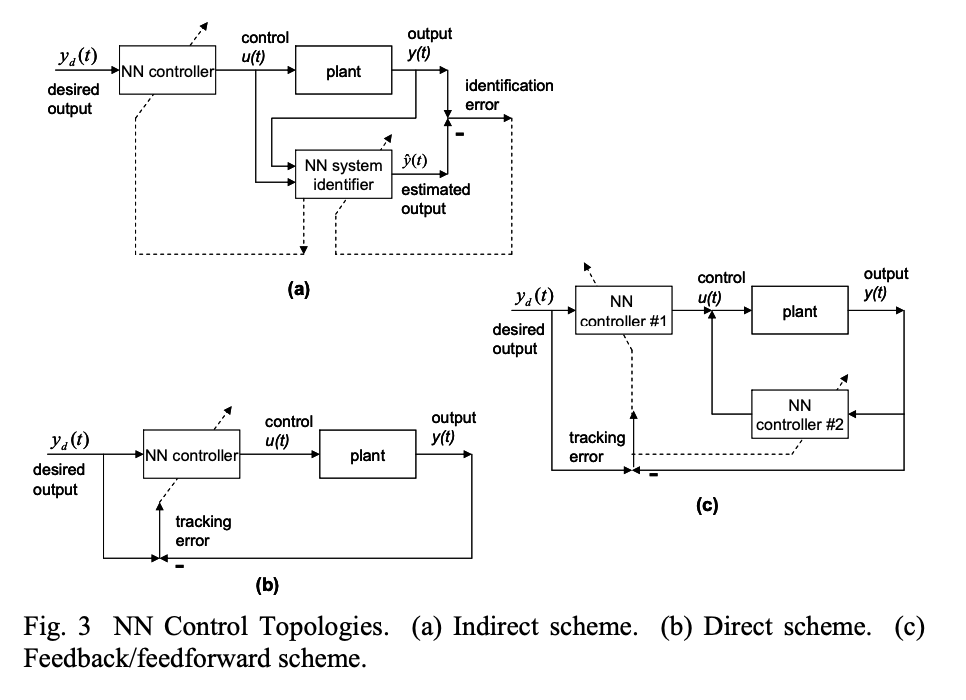

 __Neural Networks in Feedback Control Systems__\
_F.L. Lewis and S.S. Ge_

<!-- START doctoc generated TOC please keep comment here to allow auto update -->
<!-- DON'T EDIT THIS SECTION, INSTEAD RE-RUN doctoc TO UPDATE -->
**Table of Contents**  

- [Introduction](#introduction)
- [Controllers' algorithms](#controllers-algorithms)
  - [Feedback Linearization Design of NN Tracking Controllers](#feedback-linearization-design-of-nn-tracking-controllers)
    - [Multi-Layer Neural Network Controller](#multi-layer-neural-network-controller)
    - [Single-layer Neural Network Controller](#single-layer-neural-network-controller)
    - [Feedback Linearization of Nonlinear Systems Using NN](#feedback-linearization-of-nonlinear-systems-using-nn)
    - [Partitioned Neural Networks and Input Preprocessing](#partitioned-neural-networks-and-input-preprocessing)
  - [NN Control for Discrete-Time Systems](#nn-control-for-discrete-time-systems)
  - [Multi-loop Neural Network Feedback Control Structures](#multi-loop-neural-network-feedback-control-structures)
  - [Feedforward Control Structures for Actuator Compensation](#feedforward-control-structures-for-actuator-compensation)
    - [Feedforward Neurocontroller for Systems with Unknown Deadzone](#feedforward-neurocontroller-for-systems-with-unknown-deadzone)
    - [Dynamic Inversion Neurocontroller for Systems with Backlash.](#dynamic-inversion-neurocontroller-for-systems-with-backlash)
  - [Neural Network Observers for Output-Feedback Control](#neural-network-observers-for-output-feedback-control)
  - [Reinforcement Learning Control Using NN](#reinforcement-learning-control-using-nn)
    - [Neural Network Reinforcement Learning Controller](#neural-network-reinforcement-learning-controller)
    - [Adaptive Reinforcement Learning Using Fuzzy Logic Critic](#adaptive-reinforcement-learning-using-fuzzy-logic-critic)
  - [Optimal Control Using NN](#optimal-control-using-nn)
    - [Neural Network H-2 Control Using the Hamilton-Jacobi-Bellman Equation](#neural-network-h-2-control-using-the-hamilton-jacobi-bellman-equation)
    - [Neural Network H-Infinity Control Using the Hamilton-Jacobi-Isaacs Equation](#neural-network-h-infinity-control-using-the-hamilton-jacobi-isaacs-equation)
  - [Approximate Dynamic Programming and Adaptive Critics](#approximate-dynamic-programming-and-adaptive-critics)

<!-- END doctoc generated TOC please keep comment here to allow auto update -->

### Introduction
The aricle provides an historical overview of development of NN usage in feedback control systems and multiloop controllers algorithms using NN.

In adaptive control there are two main Neural Network Control Topologies: direct and inderect. __Indirect__ control aims to learn dynamics of the unknown plant (dynamical system) via *identifier block* first; then it uses aquired information to control the plant via *controller block*. __Direct control__ directly tunes the parameters of an adjustable NN controller. 
 solid lines denote signal flow, dashed line - tuning. 
 
The challenge in using NN for __feedback control__ is to select a adequate control system structure, and then to tune the NN weights to guarantee closed-loop stability and performance.

The use of neural networks (NN) in feedback control systems was first proposed by Werbos [1989]. Early works aimed to adress several challenges for closed-loop controll systems. The main are: "weight initialization for feedback stability, determining the gradients needed for backpropagation tuning, determining what to backpropagate, obviating the need for preliminary off-line tuning, modifying backprop so that it tunes the weights forward through time". Overviews of the early works regarding NN control could be found in the Handbook of Intelligent Control [White 1992]. 

------------------------------------------------------------
### Controllers' algorithms

#### Feedback Linearization Design of NN Tracking Controllers
The section dedicated to  NN feedback controllers that  makes a robotic system to follow a certain trajectory or path in conditions where nor the dynamics of the robot, nor disturbances are known.

##### Multi-Layer Neural Network Controller
It's assumed that desired controller function and appropriate weights are unknown. 
The NN design approach allows for nonlinearity in the parameters, and in effect the NN learns its own basis set on-line to approximate the unknown function f(x). The structure consists of two loops: _the feedback linearization loop_ which incorparates the NN which learns  the unknown dynamics on-line to cancel the nonlinearities of the system. The outer _PD tracking loop_ controlls behavior with specally predifined robustifying function.  Tthe stability of the algorithm is proven using nonlinear stability theory (an extension of Lyapunov’s theorem).

##### Single-layer Neural Network Controller
If the first layer weights V are fixed so that one has the simplified tuning algorithm for the output-layer weights update. 

##### Feedback Linearization of Nonlinear Systems Using NN
 Feedback Linearization NN controller input has two parts: a _feedback_ linearization part and plus an extra _robustifying_ part. Then two separate NNs are trained. For the first one the weight update is exactly the same as in the Multi-Layer Neural Network Controller. To train the second NN the formula should be modified in a way that makes it's output bounded away from zero. Otherwise the whole control would be infinite. 

##### Partitioned Neural Networks and Input Preprocessing
This approach implies partitioning of the controller in terms of partitioned NN or neural subnets. This simplifies the design, gives added controller structure, and allows faster weight tuning algorithms. An advantage of this structured NN is that if some terms in the robot dynamics are well-known (e.g. inertia matrix M(q) and gravity G(q)), then their NNs can be replaced by equations that explicitly compute these terms.

#### NN Control for Discrete-Time Systems
To implement a controller algorythm on a computer it is necessary to specify it in a digital(discrete-time) form. In 1999 Lewis, Jagannathan, and Yesildirek showed that it is possible to guarantee system stability and robustness with an N-layer NN controller. Sich a controller should be composed of two parts: the gradient algorithm and robystifying descrete-time term(a.k.a. "forgetting term"). 

#### Multi-loop Neural Network Feedback Control Structures

The class of controllers with _include additional inner feedback loops_ is required for systems with _additional dynamical complications_ or _additional performance requirements_. using Lyapunov energy-based techniques, it was shown that if each loop is bounded (state-strict passive1), then the overall multiloop NN controller provides stability, performance, and bounded NN weights (Lewis, Jagannathan, and Yesildirek,  1999).
There are sevral examples of Multi-loop NN controllers provided in the article : Backstepping Neurocontroller for __Electrically Driven Robot__; __Compensation of Flexible Modes and High-Frequency Dynamics__ and __a Force Control algorithm__. 
________________________________________________________________
1 _a  _passive system_ is a system, which cannot store more energy, than energy supplied to the system. A _strictly passive system_ bounded further by some parameter,lower than amout of input energy.  For more information about passivity in control systems consult these papers: http://www.l2s.centralesupelec.fr/sites/l2s.centralesupelec.fr/files/users/loria/teaching/passivity-in-control-systems.pdf ,  https://www.hindawi.com/journals/mpe/2015/591854/ ._
_______________________________________________________________

#### Feedforward Control Structures for Actuator Compensation
Since these actuator nonlinearities appear in the feedforward loop, the NN compensator must also appear in the feedforward loop

##### Feedforward Neurocontroller for Systems with Unknown Deadzone 
__The deadzone__ is a state when the control signal takes on small values or passes through zero. ,( since only values greater than a certain threshold can influence the system.)
##### Dynamic Inversion Neurocontroller for Systems with Backlash.
__Blacklash__ - situation,  when the control signal reverses in value.

#### Neural Network Observers for Output-Feedback Control
The idea of this control scheme comes from  an observer concept in control system theory.
This type of NN controllers could be used when only not all internal system information is measurable (which is almost always a case in industry) and available for a feedback.  In this case an additional dynamic NN is used. This additional NN meant to provide estimates of the unmeasurable plant states.

#### Reinforcement Learning Control Using NN
First proposed by Mendel in  1970. Since then were rigously studied and developed. Implemintation of reinforcement learning in the control system theory frame struggles with variety of difficulties due to reduced information and therefore complications in prooving it's stability. 
##### Neural Network Reinforcement Learning Controller 
Initially, action generating NN takes as input the desired trajectory  as the user input. Then, after a plant performs an action, resulting in  the _instanteous utility_ - r(t) -  is calculated. Then the signum2 function of the r(t) is taken to critique the perfomance of the system. 

, where
.

Afterwards the NN weights are tuned using only R(t) with
 This tuning algorithm's stability and tracking of closed-loop system is proven with  _Lyapunov energy fynction_. 

____________
2The _signum_ function is the derivative of the absolute value function (up to the indeterminacy at zero): . At zero the function is equals zero, which is useful for reinforcment learning: zero considered as a reward, where as other values as a punishment. 
____________________

##### Adaptive Reinforcement Learning Using Fuzzy Logic Critic
This algorithm uses fuzzy logic system as a critic and a NN as an action generator, which controls the system. The critic system can be initialized via linguistic or heuristic notions by the user, and later on ine can interpret which information was stored by the system during the learning process. 

The adaptive Critic unit output has the form of an input x parced to the Action generating NN. 
, where W is an output values and q is a set of fuzzy logic basis functions. The basis functions are _membership functions_, and ususally represented by triangle functions. Instead of them,  splines, 2nd and 3rd degree polynomials, and the RBF functions could be used. 

#### Optimal Control Using NN
##### Neural Network H-2 Control Using the Hamilton-Jacobi-Bellman Equation 
##### Neural Network H-Infinity Control Using the Hamilton-Jacobi-Isaacs Equation

#### Approximate Dynamic Programming and Adaptive Critics 
The goal of ADP is to evaluate the optimal value and optimal control using techniques that progress forward in time. There are several techniques wich can be used:
- Heuristic Dynamic Programming (HDP): has both action generating and critic NNs with tunable parameters. 
- Dual Heuristic Programming (DHP): additionaly to optimal value approximation, pedicts it's gradient via an NN
- Q-Learning or Action Dependent HDP: uses Q function. 

